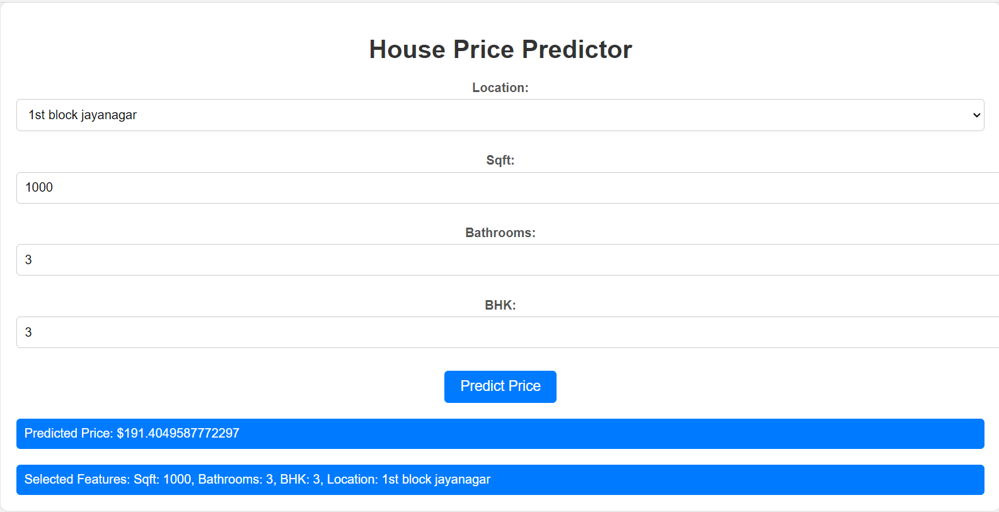
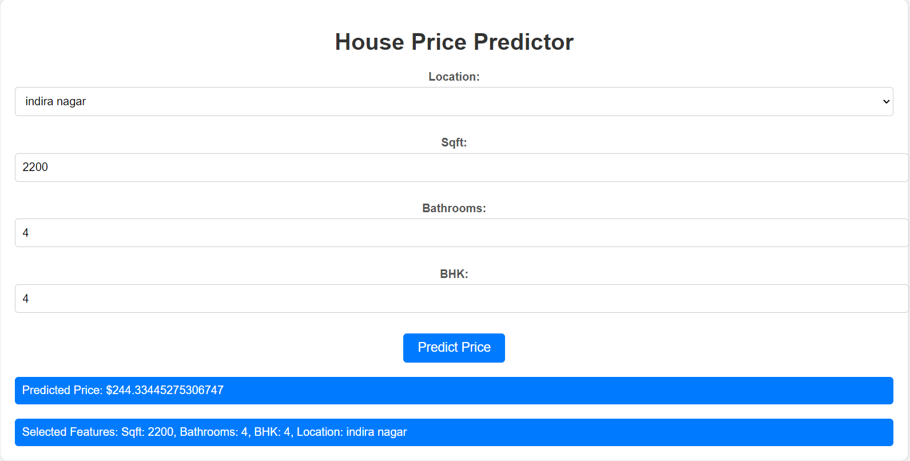

# House Price Prediction Web App

This project is a web application for predicting house prices using a machine learning model. The app allows users to input various features such as square footage, number of bathrooms, number of bedrooms, and location, and it provides an estimated price based on the provided information.

## Project Overview

The web app is built using Flask, a Python web framework. It integrates a machine learning model trained on a dataset of real estate prices. The model considers features like square footage, bathrooms, bedrooms, and location to make predictions.

## Features

- User-friendly interface for inputting house details.
- Integration with a trained machine learning model to predict house prices.
- Dropdown menu for selecting the location, with options generated from the dataset.
- Attractive styling using CSS to enhance the user experience.

## Getting Started

1. Clone this repository to your local machine.
2. Install the required dependencies using `pip install -r requirements.txt`.
3. Run the Flask app using `python app.py`.

## How to Use

1. Access the app through your browser by navigating to `http://localhost:5000` after running the app.
2. Fill in the required details including square footage, bathrooms, bedrooms, and location from the dropdown.
3. Click the "Predict Price" button to get an estimated house price.
4. The app will display the predicted price along with the selected features.

## Preview

## Example prediction result:

